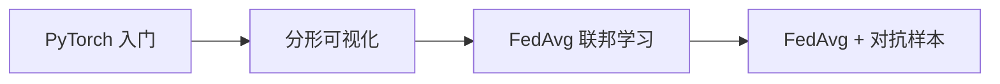

# AI 学习实验 🧠

我的 AI 学习探索记录，从 PyTorch 入门到联邦学习与对抗样本研究。

## 目录结构

```
AI-Experiments/
├── notebooks/                        # Jupyter Notebook 实验
│   ├── first_pytorch.ipynb           # PyTorch 入门初探
│   ├── fractal_visualization.ipynb   # Julia 集分形可视化
│   ├── fedavg_minimal.ipynb          # FedAvg 联邦学习基础实现
│   └── fedavg_adversarial_experiment.ipynb  # FedAvg + 对抗样本实验
├── data/                             # 数据集
└── README.md
```

## 学习路线



## 实验内容

### 1. PyTorch 入门 — `first_pytorch.ipynb`
> 从零开始接触 PyTorch 框架，验证环境配置，迈出深度学习第一步。

### 2. 分形可视化 — `fractal_visualization.ipynb`
> 使用 NumPy + Matplotlib 生成 Julia 集分形图像，理解迭代系统与视觉之美。

### 3. FedAvg 联邦学习 — `fedavg_minimal.ipynb`
> 使用 PyTorch 实现 **FedAvg** 算法，在 MNIST 数据集上模拟分布式训练，探索"数据不动模型动"的核心思想。

### 4. FedAvg + 对抗样本 — `fedavg_adversarial_experiment.ipynb`
> 在联邦学习框架中引入对抗样本攻击，研究分布式场景下模型的鲁棒性与安全性。

## 环境要求

```bash
pip install torch numpy matplotlib jupyter
```

## 许可证

MIT
